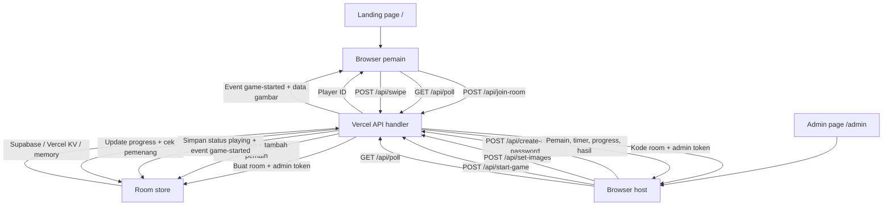

# SwipeRush

Game web mobile real-time tempat pemain berlomba **swipe-reveal** gambar blur. Pemain pertama yang mencapai 95% menang!

Dibuat dengan **Node.js + Express** dan frontend vanilla HTML/CSS/JS. Tidak ada build step, bisa dijalankan lokal atau di Vercel.

## Screenshot

| Home | Admin Lobby | Playing | Results |
|------|-------------|---------|---------|
|  |  |  |  |

## Fitur

- **Multiplayer real-time** — HTTP polling untuk room, sinkronisasi timer, dan progress
- **Scratch-off canvas** — swipe untuk membuka gambar blur
- **Kontrol host** — atur batas waktu 15–120 detik, kelola gambar, finish lebih awal
- **Banyak gambar** — upload sampai 5 PNG; tiap ronde memilih satu gambar secara acak
- **Deteksi pemenang** — pemain pertama yang mencapai 95% menang; top 3 tampil di podium
- **Tema terang/gelap** — tombol toggle, tersimpan di localStorage
- **Mobile-first** — UI responsif dengan animasi dan confetti
- **Siap Vercel** — API berbasis polling berjalan di serverless; Supabase atau Vercel KV bisa dipakai untuk menyimpan room multiplayer

## Cara Main

1. **Host** membuka `/admin`, memasukkan kata sandi create room, upload gambar, lalu membagikan kode 4 huruf.
2. **Pemain** membuka `/` dan masuk dengan nickname.
3. **Host** memulai game; setiap pemain melihat gambar blur.
4. **Swipe** untuk menghapus blur dan membuka gambar.
5. **Pertama mencapai 95%** menang. Hasil tampil di podium dengan confetti.

## Alur Aplikasi



Frontend tidak pernah terhubung langsung ke Supabase atau KV. Browser hanya memanggil `/api/*`; API server-side yang membaca dan menulis state room ke store yang dikonfigurasi.

## Jalankan Lokal

```sh
npm install
npm start
```

Buka `http://localhost:3000` di HP atau desktop.

Untuk test Supabase lokal, copy `.env.example` menjadi `.env`, lalu isi nilai Supabase kamu. Simpan `.env` hanya di lokal; file itu sudah di-ignore oleh Git.

Untuk membatasi siapa yang bisa membuat room, set `CREATE_ROOM_PASSWORD`. Landing page di `/` hanya untuk pemain; host membuat room dari `/admin`.

## Deploy ke Vercel

```sh
npm i -g vercel
vercel
```

API memakai HTTP polling, bukan WebSocket, jadi bisa berjalan di environment serverless Vercel.

### Penting: gunakan shared storage untuk state room di Vercel

Vercel serverless function tidak menjamin setiap request masuk ke instance warm yang sama. Kalau state room hanya disimpan di memory, host bisa membuat room di instance A, lalu upload gambar atau start game masuk ke instance B. Hasilnya bisa `Unauthorized` atau `Room not found`.

Salah satu opsi sederhana adalah Vercel KV:

1. Buka **Vercel Dashboard → Storage** untuk project kamu.
2. Klik **"Create Database"** lalu pilih **"Vercel KV"**.
3. Pilih region paling dekat dengan pemain, misalnya Singapore untuk Asia.
4. Environment variables akan otomatis terhubung, lalu redeploy:

```sh
npx vercel deploy --prod --yes
```

KV menyimpan room agar tetap tersedia saat cold start atau pindah instance serverless.

### Setup Supabase

Supabase juga cocok untuk state room. Buat table ini di Supabase SQL Editor:

```sql
create table if not exists rooms (
  code text primary key,
  data jsonb not null,
  updated_at timestamptz not null default now(),
  expires_at timestamptz not null
);
```

Lalu tambahkan Vercel Environment Variables:

```sh
CREATE_ROOM_PASSWORD=your-admin-password
SUPABASE_URL=https://your-project-ref.supabase.co
SUPABASE_SERVICE_ROLE_KEY=your-service-role-or-secret-key
```

Opsional, hanya kalau nama table bukan `rooms`:

```sh
SUPABASE_ROOMS_TABLE=rooms
```

Cara mengambil nilainya:

1. Buka **Supabase Dashboard → Project Settings → API**.
2. Copy **Project URL** ke `SUPABASE_URL`.
3. Copy server-side secret key ke `SUPABASE_SERVICE_ROLE_KEY`. Jangan pakai key ini di frontend.
4. Di Vercel, buka **Project → Settings → Environment Variables**, tambahkan untuk Production, lalu redeploy.

Setelah deploy, buka `/api/health`. Hasilnya harus seperti ini:

```json
{
  "durableStorage": true,
  "storageProvider": "supabase"
}
```

Tanpa shared storage, game akan fallback ke memory. Ini masih bisa untuk lokal, tapi tidak reliable untuk multiplayer di Vercel.

Tidak harus memakai Redis/KV, tapi multiplayer di Vercel tetap butuh shared storage. Alternatif yang masuk akal:

1. **Postgres** lewat Vercel Postgres, Neon, Supabase, atau Railway.
2. **Firebase/Firestore** untuk state room berbentuk dokumen.
3. **Host Node persistent** seperti Railway, Render, Fly.io, atau VPS, agar satu proses Node bisa menyimpan state di memory dan opsional memakai WebSocket.

Vercel Blob/object storage tidak direkomendasikan untuk state game ini karena progress pemain sering berubah dan object write kurang cocok untuk data mutable berlatensi rendah.

### Troubleshooting: Start Game tetap disabled

Host hanya bisa start setelah minimal satu upload PNG berhasil disimpan oleh API. Kalau tombol tetap disabled:

1. Pastikan file upload adalah PNG dan maksimal 5 gambar.
2. Cek request `set-images` di browser Network tab dan pastikan sukses.
3. Buka `/api/health`. `durableStorage` harus `true` di Vercel untuk multiplayer yang reliable.
4. Pastikan environment variables Supabase atau KV sudah terpasang di deployment, lalu redeploy setelah menambahkannya.

## Tech Stack

- **Backend:** Node.js, Express-style serverless handler
- **Frontend:** Vanilla HTML/CSS/JS tanpa framework atau build tool
- **Realtime:** HTTP polling
- **Persistence:** Supabase atau Vercel KV jika dikonfigurasi; fallback memory untuk lokal
