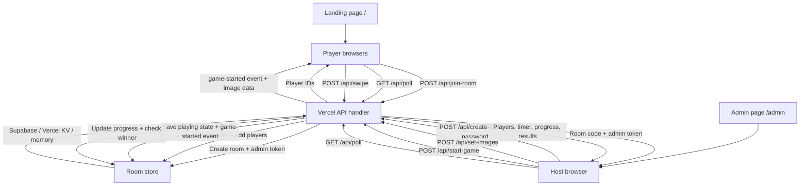

# SwipeRush

A real-time mobile web game where players race to **swipe-reveal** a blurred image. First to 95% wins!

Built with **Node.js + Express** and a vanilla HTML/CSS/JS frontend. It has no build step and can run locally or on Vercel.

## Screenshots

| Home | Admin Lobby | Playing | Results |
|------|-------------|---------|---------|
|  |  |  |  |

## Features

- 🎮 **Real-time multiplayer** — HTTP polling for rooms, timer sync, and progress
- 🖼️ **Scratch-off canvas** — swipe to reveal a blurred image underneath
- 👑 **Admin controls** — set time limit (15–120s), manage images, finish early
- 📸 **Multiple images** — upload up to 5 PNGs; each round picks one at random
- 🏆 **Winner detection** — first player to 95% wins; top 3 shown on a podium
- 🌓 **Light/dark theme** — toggled with a button, saved to localStorage
- 📱 **Mobile-first** — responsive UI with bouncy animations and confetti
- ☁️ **Vercel-ready** — polling-based API works on serverless; Supabase or Vercel KV can store multiplayer rooms

## How to Play

1. **Host** opens `/admin`, enters the create room password, uploads images, and shares the 4-letter code
2. **Players** open `/` and join with a nickname
3. **Host** starts the game — each player sees a blurred image
4. **Swipe** to scratch off the blur and reveal the image
5. **First to 95%** wins! Results show on a podium with confetti 🎉

## Application Flow



The frontend never connects directly to Supabase or KV. Browsers only call `/api/*`; the server-side API reads and writes room state using the configured store.

## Run Locally

```sh
npm install
npm start
```

Open `http://localhost:3000` on your phone or desktop.

For local Supabase testing, copy `.env.example` to `.env` and fill in your Supabase values. Keep `.env` local only; it is ignored by Git.

To protect room creation, set `CREATE_ROOM_PASSWORD`. The landing page at `/` is player-only; hosts create rooms from `/admin`.

## Deploy on Vercel

```sh
npm i -g vercel
vercel
```

The API uses HTTP polling instead of WebSocket, so it can run in Vercel's serverless environment.

### Important: use shared storage for Vercel room state

Vercel serverless functions do not guarantee that every request uses the same warm instance. If room state is only stored in memory, the host can create a room on one instance and then hit another instance during image upload or start, causing `Unauthorized` or `Room not found`.

One simple option is Vercel KV:

1. Go to **Vercel Dashboard → Storage** for your project
2. Click **"Create Database"** → select **"Vercel KV"**
3. Choose the region closest to your players (e.g., Singapore for Asia)
4. The environment variables are auto-linked — redeploy:

```sh
npx vercel deploy --prod --yes
```

The KV store keeps rooms alive across cold starts and serverless instances.

### Supabase setup

Supabase also works well for room state. Create this table in the Supabase SQL Editor:

```sql
create table if not exists rooms (
  code text primary key,
  data jsonb not null,
  updated_at timestamptz not null default now(),
  expires_at timestamptz not null
);
```

Then add these Vercel Environment Variables:

```sh
CREATE_ROOM_PASSWORD=your-admin-password
SUPABASE_URL=https://your-project-ref.supabase.co
SUPABASE_SERVICE_ROLE_KEY=your-service-role-or-secret-key
```

Optional, only if your table name is not `rooms`:

```sh
SUPABASE_ROOMS_TABLE=rooms
```

Where to find the values:

1. Open **Supabase Dashboard → Project Settings → API**.
2. Copy the **Project URL** into `SUPABASE_URL`.
3. Copy a server-side secret key into `SUPABASE_SERVICE_ROLE_KEY`. Do not use this key in frontend code.
4. In Vercel, open **Project → Settings → Environment Variables**, add the values for Production, then redeploy.

After deploy, open `/api/health`. It should show:

```json
{
  "durableStorage": true,
  "storageProvider": "supabase"
}
```

Without shared storage, the game uses in-memory fallback only, which works locally but is not reliable for multiplayer on Vercel.

You do not have to use Redis/KV specifically, but multiplayer on Vercel still needs shared storage. Practical alternatives:

1. **Postgres** via Vercel Postgres, Neon, Supabase, or Railway.
2. **Firebase/Firestore** for document-style room state.
3. **A persistent Node host** such as Railway, Render, Fly.io, or a VPS, where one Node process can keep in-memory room state and optionally use WebSocket.

Vercel Blob/object storage is not recommended for this game state because players update progress frequently and object writes are not a good fit for low-latency mutable room data.

### Troubleshooting: Start Game stays disabled

The host can start only after at least one PNG upload is successfully saved by the API. If the button stays disabled:

1. Confirm the upload uses PNG files and no more than 5 images.
2. Check that the `set-images` request returns success in the browser Network tab.
3. Call `/api/health`. `durableStorage` should be `true` on Vercel for reliable multiplayer.
4. Confirm Supabase or KV environment variables are attached to the deployment and redeploy after adding them.

## Tech Stack

- **Backend:** Node.js, Express-style serverless handler
- **Frontend:** Vanilla HTML/CSS/JS (no frameworks or build tools)
- **Realtime:** HTTP polling
- **Persistence:** Supabase or Vercel KV when configured; in-memory fallback locally
