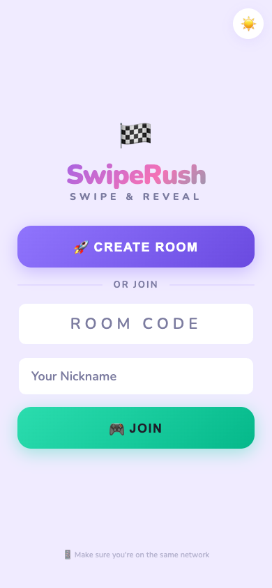
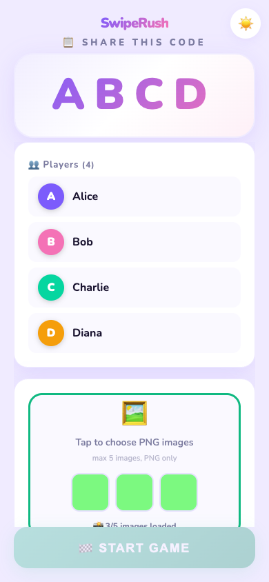
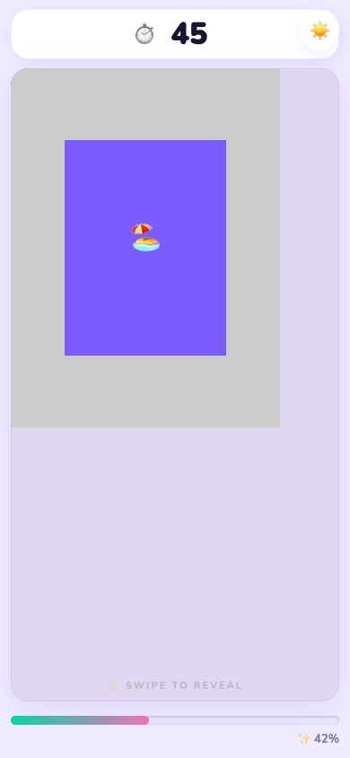

# SwipeRush 🏁

A real-time mobile web game where players race to **swipe-reveal** a blurred image. First to 95% wins!

Built with **Node.js + Express + Socket.IO** — zero build step, vanilla HTML/CSS/JS frontend.

## Screenshots

| Home | Admin Lobby | Playing | Results |
|------|-------------|---------|---------|
|  |  |  |  |

## Features

- 🎮 **Real-time multiplayer** — Socket.IO handles rooms, timer sync, and progress
- 🖼️ **Scratch-off canvas** — swipe to reveal a blurred image underneath
- 👑 **Admin controls** — set time limit (15–120s), manage images, finish early
- 📸 **Multiple images** — upload up to 5 PNGs; each round picks one at random
- 🏆 **Winner detection** — first player to 95% wins; top 3 shown on a podium
- 🌓 **Light/dark theme** — toggled with a button, saved to localStorage
- 📱 **Mobile-first** — responsive UI with bouncy animations and confetti

## How to Play

1. **Host** creates a room, uploads images, and shares the 4-letter code
2. **Players** join with a nickname
3. **Host** starts the game — each player sees a blurred image
4. **Swipe** to scratch off the blur and reveal the image
5. **First to 95%** wins! Results show on a podium with confetti 🎉

## Run Locally

```sh
npm install
npm start
```

Open `http://localhost:3000` on your phone or desktop.

## Deploy

### Option 1: Local server (easiest for parties)

```sh
npm install
npm start
```

Share your local IP with players on the same Wi-Fi.

### Option 2: Frontend on Vercel + Backend on Railway

**Backend** (on [Railway](https://railway.app), [Render](https://render.com), or any Node.js host):

```sh
npm install
node server/index.js
```

Set `PORT=3000` and deploy the entire repo as a Node.js app.

**Frontend** (on Vercel):

```sh
npm i -g vercel
vercel
```

Then in `public/index.html`, add before the closing `</head>`:

```html
<script>window.__SWIPE_SERVER__ = 'https://your-backend-url.railway.app';</script>
```

Replace the URL with your deployed backend.

## Tech Stack

- **Backend:** Node.js, Express, Socket.IO
- **Frontend:** Vanilla HTML/CSS/JS (no frameworks or build tools)
- **Persistence:** JSON file (best-effort; in-memory fallback on read-only filesystems)
